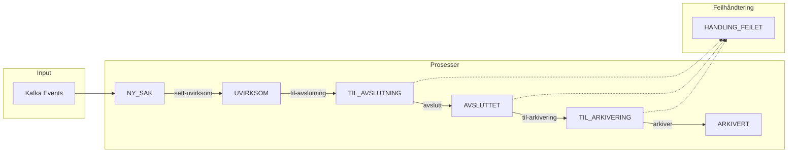
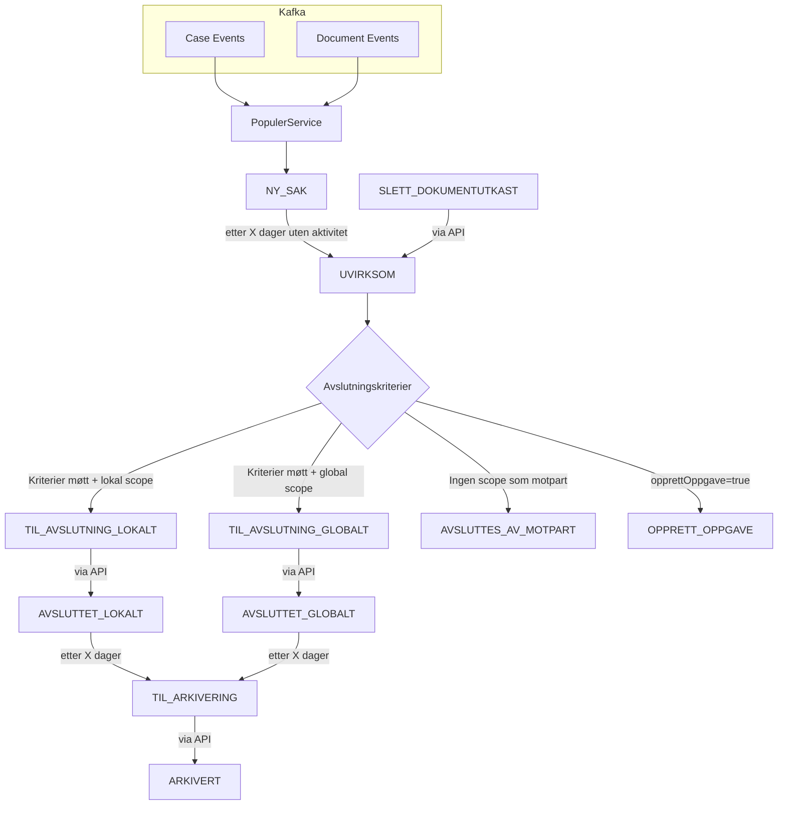
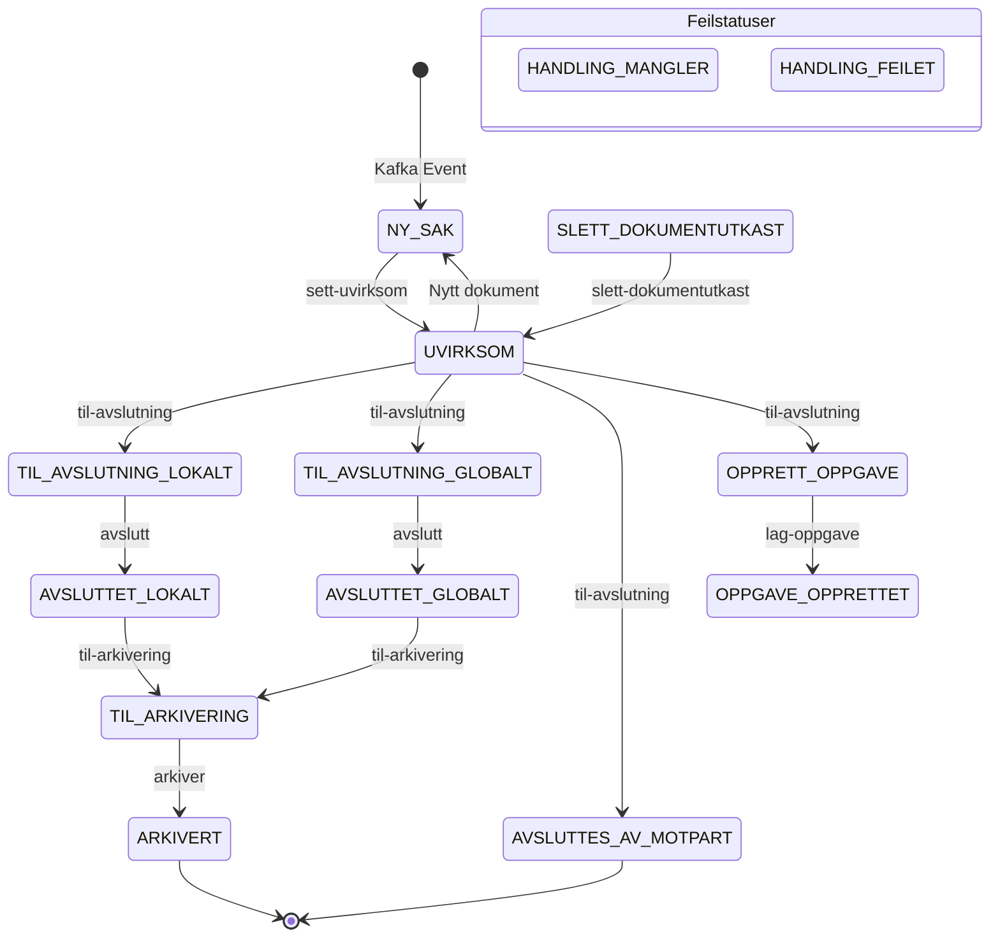
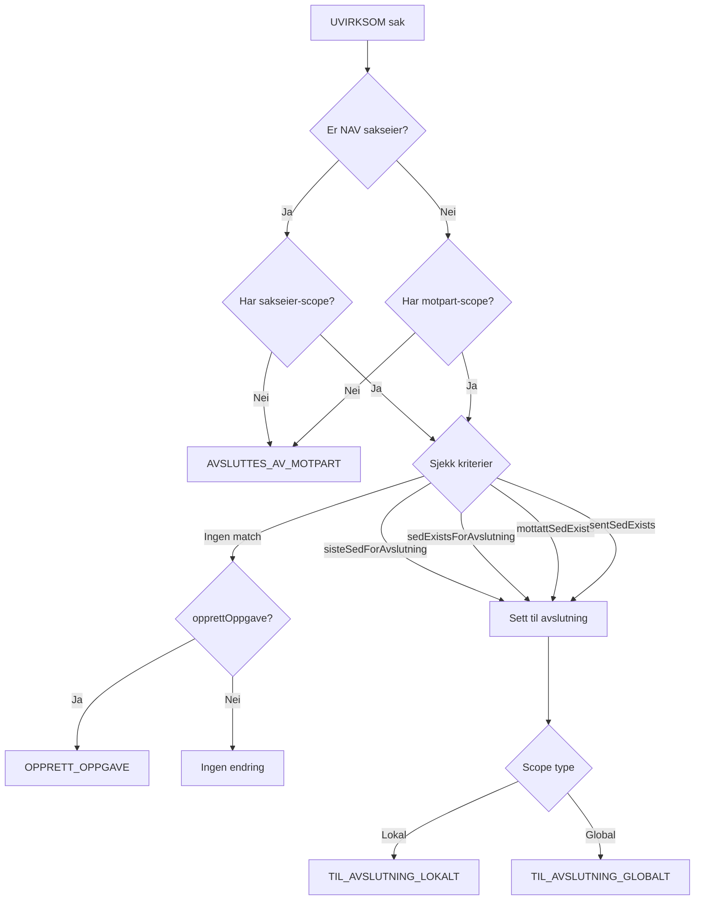

### EUX Avslutt Rinasaker

Denne applikasjonen tilbyr tjenester i `AvsluttRinasakerApi` som avslutter og håndterer status
på rinasaker. Den er bygget med Kotlin og Spring Boot, og bruker Maven som byggesystem.
Applikasjonen integrerer med Kafka for å håndtere dokument- og sakshendelser.

## Prosessflyt Diagram



### Detaljert Flyt



## Status Oversikt

Alle mulige statuser og overganger:



## Til-Avslutning Beslutningslogikk

Når en sak er `UVIRKSOM`, evalueres følgende regler i rekkefølge:



### Avslutningskriterier

| Kriterie | Beskrivelse |
|----------|-------------|
| `sisteSedForAvslutning` | Siste SED er av en bestemt type (og eventuelt sendt fra NAV) |
| `sedExistsForAvslutning` | En bestemt SED eksisterer i saken |
| `mottattSedExists` | En mottatt SED av en bestemt type finnes |
| `sentSedExists` | En sendt SED av en bestemt type finnes |

## Prosesser i APIet

### Sett Uvirksom

Markerer rinasaker som uvirksomme ved å oppdatere statusen til saken. Denne prosessen
bruker `SettUvirksomService` for å utføre operasjonen.

### Til Avslutning

Setter rinasaker til avslutning ved å oppdatere statusen til saken. Denne prosessen
bruker `TilAvslutningService` for å utføre operasjonen.

### Avslutt

Avslutter rinasaker ved å oppdatere statusen til saken og eventuelt arkivere den. Denne
prosessen bruker `AvsluttService` for å utføre operasjonen.

### Lag Oppgave

Lager oppgave for manuell avslutning av rinasaker. Denne prosessen er foreløpig ikke
implementert, men vil lage en oppgave som krever manuell intervensjon.

### Til Arkivering

Setter rinasaker til arkivering ved å oppdatere statusen til saken. Denne prosessen
bruker `TilArkiveringService` for å utføre operasjonen.

### Arkiver

Arkiverer rinasaker ved å oppdatere statusen til saken og flytte den til arkivet.
Denne prosessen bruker `ArkiverService` for å utføre operasjonen.

### Slett Dokumentutkast

Sletter dokumentutkast for X001 i rinasaker som har status `SLETT_DOKUMENTUTKAST`. 
Ved suksess settes saken tilbake til `UVIRKSOM` status. Denne prosessen bruker 
`SlettDokumentutkastService` for å utføre operasjonen via `eux-rina-terminator-api`.

## Brukte teknologier

* Kotlin
* Spring Boot
* Maven
* Kafka

#### Avhengigheter

* JDK 21

## API Dokumentasjon

APIet er dokumentert med Swagger og tilbyr følgende endepunkt for å starte prosesser:

```POST /api/v1/prosesser/{prosess}/execute```

### Parametere

* `prosess` - Navnet på prosessen som skal startes:
    * `sett-uvirksom` - Markerer rinasaker som uvirksomme
    * `til-avslutning` - Sett rinasaker til avslutning
    * `avslutt` - Avslutter rinasaker
    * `lag-oppgave` - Lager oppgave for manuell avslutning av rinasaker
    * `til-arkivering` - Setter rinasaker til arkivering
    * `arkiver` - Arkiverer rinasaker
    * `slett-dokumentutkast` - Sletter dokumentutkast for X001

## BUC Setup

`Buc.kt` definerer hvordan BUC-er skal håndteres i applikasjonen.

| Variabel                                           | Beskrivelse                                                                                                                             | Eksempelverdi                     |
|----------------------------------------------------|-----------------------------------------------------------------------------------------------------------------------------------------|-----------------------------------|
| `navn`                                             | Navnet på BUC, må matche med setup i RINA                                                                                               | `"H_BUC_01"`                      |
| `antallDagerBeforeUvirksom`                        | Antall dager før BUC blir uvirksom, uvirksom er staten før det kjøres regler for å se om det skal avsluttes                             | `90`                              |
| `antallDagerBeforeArkivering`                      | Antall dager før arkivering                                                                                                             | `180`                             |
| `sisteSedForAvslutningAutomatisk`                  | Liste over SED-er for automatisk avslutning, BUC vil avsluttes automatisk hvis saken er uvirksom og SED'en er i lista                   | `["H002"]`                        |
| `sisteSedForAvslutningAutomatiskKrevesSendtFraNav` | Kreves siste SED sendt fra NAV for automatisk avslutning, `true` hvis det kreves at siste SED er sendt fra NAV                          | `false`                           |
| `sedExistsForAvslutningAutomatisk`                 | Liste over eksisterende SED-er for automatisk avslutning, hvis SED i lista eksisterer kan det avsluttes automatisk hvis BUC er uvirksom | `["F003"]`                        |
| `mottattSedExistsForAvslutningAutomatisk`          | Liste over mottatte SED-er for automatisk avslutning, hvis SED i lista eksisterer kan det avsluttes automatisk hvis BUC er uvirksom     | `["U002", "U004"]`                |
| `sentSedExistsForAvslutningAutomatisk`             | Liste over sendte SED-er for automatisk avslutning, hvis SED i lista eksisterer kan det avsluttes automatisk hvis BUC er uvirksom       | `["H070"]`                        |
| `bucAvsluttScopeSakseier`                          | Angir om saken skal avsluttes lokalt eller globalt automatisk når vi er sakseier, hvis `null` vil ikke saken avsluttes automatisk       | `BucAvsluttScope.AVSLUTT_LOKALT`  |
| `bucAvsluttScopeMotpart`                           | Angir om saken skal avsluttes lokalt eller globalt automatisk når vi er motpart, hvis `null` vil ikke saken avsluttes automatisk        | `BucAvsluttScope.AVSLUTT_GLOBALT` |
| `opprettOppgave`                                   | Hvis ikke kriterier er møtt og saken er uvirksom kan det lages oppgave, aktivt ved `true`                                               | `true`                            |
